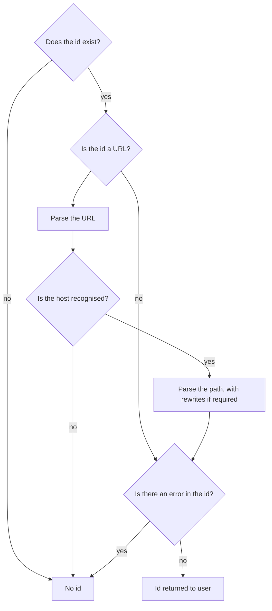

# Canvas Id Parsing
* Status: decided
* Author: Jack Lewis
* Decider: Jack Lewis
* Date: 2026-02-24

## Context and Problem Statement

When a canvas id comes into the system there are several formats this id can be in (such as a flat id, a URL or a rewritten path).  On top of that, due to mixed manifests, we need  a way to match up canvases between `items` and `paintedResources` and this is done through the canvas id.  As such a set of rules needs to be enforced around how the canvas id is parsed and where

## Decision Drivers

- Share as much logic between `items` and `paintedResources` as possible - there will be some differences, but the code should be shared as much as possible

## Decision Outcome

The rules for this can get fairly complex, so this diagram shows the logic flow:



There are a few separate errors that are checked for, these are as follows:
- Prohibited characters - `'/', '=', ','`
- If an id cannot be parsed from the URL

While there is no difference in the *logic* between parsing the id for `items` and `paintedResources`, where there **is** a difference is in the outcome of failures to  parse (i.e.: the `No id` outcome).  Namely, that in `items`, a failure will result in a generated id, whereas in `paintedResources` an error will be returned to the user.  This difference is because `items` can be copied and pasted from another user of the system, whereas `paintedResources` is purposeful as these can only be retrieved directly using an authenticated user.

Additionally, in the checking for an error in the id, there is an additional check in `items` parsing to make sure an id matches an id from `paintedResources`, as setting the canvas id like this only matters with a matched canvas.  If there is no matching id, then the canvas id will be generated for items.  

For example:

```json
{
    "type": "Manifest",
    "slug": "first-example",
    "parent": "-container-",
    "items": [
        {
            "id": "https://presentation.example/99/canvases/alpha",
        }
    ],
    "paintedResources": [
        {
            "canvaSPainting": {
                "canvasId": "https://presentation.example/99/canvases/alpha",
            }
        }
    ]
}
```

would result in the canvas id of `alpha`, whereas this:

```json
{
    "type": "Manifest",
    "slug": "first-example",
    "parent": "-container-",
    "items": [
        {
            "id": "https://presentation.example/99/canvases/alpha",
        }
    ]
}
```

would result in a generated id