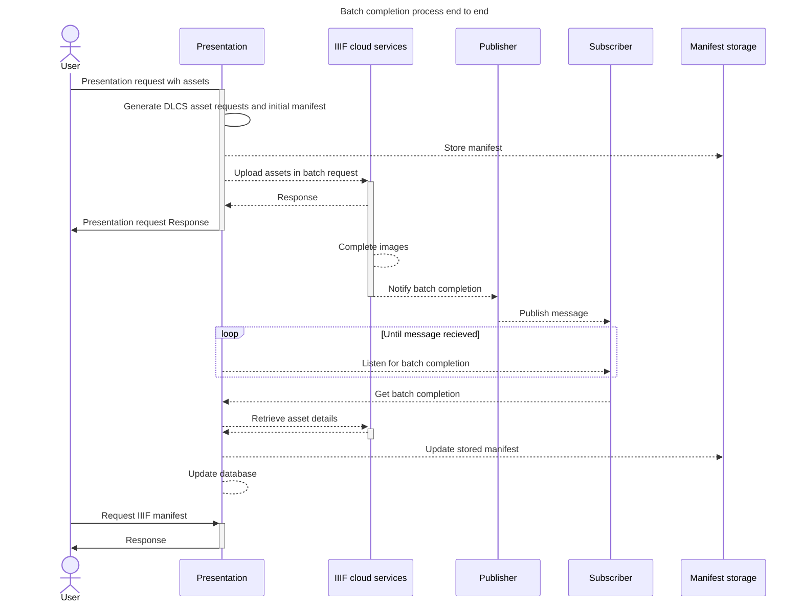
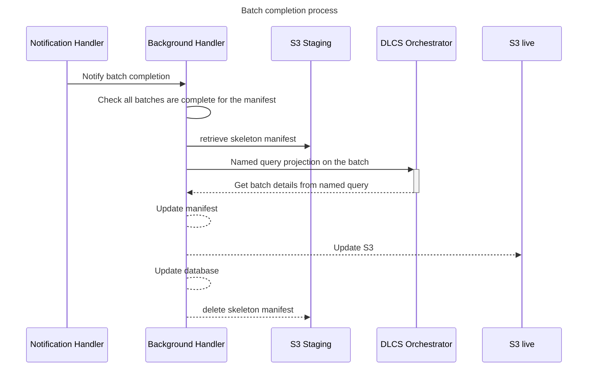

# Batch Completion Handling

see [Revisit Batches](https://github.com/dlcs/protagonist/pull/929/files#diff-0d380a6db64580407caa9f4adf06d996bda15e74e4781bc048b2ebf4da8e7b74) for the RFC on the Protagonist side of this work

Once a batch is completed by Protagonist, there are a series of steps that need to be completed that update the manifest with information from the completed images.

This RFC outlines how the following will be accomplished:

- Retrieve details from the DLCS Orchestrator
- Update the manifest and database with details from the DLCS

## Full process

This is an example of how this batch completion process works end to end

## Batch completion process

Updating the details of a batch requires a call to orchestrator to add the `Image-Service` and thumbnails.  Additionally, details are retrieved from an initial S3 staging location, which includes details of the manifest that are not saved in the database or are not returned by the DLCS (such as `homepage`)

This process can be demonstrated below:

Addditional processing within batch completion is to generate IIIF multiple choice constructs from painted resources and merging thumbnails.

see [this protagonist RFC](https://github.com/dlcs/protagonist/blob/main/docs/rfcs/019-presentation-dlcs.md) for details of how the querying assets work in protagonist
