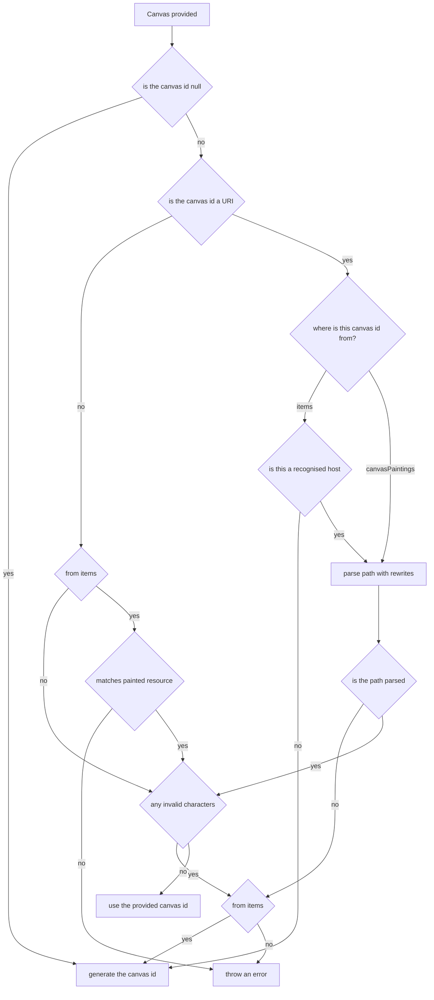

# Canvas Id parsing

When parsing payloads, the `canvasId` can be used to generate a `canvasPainting` `id` record.  This can be accepted either directly from a `canvasPainting` `canvasId` and also from `items` `id` of a canvas.  In addition to the 2 locations that we can generate a `canvasId` from, we can accept either a short form (i.e.: just the id itself) or alternatively from a recognised URI.  Finally, this `canvasId` can be used to join a `canvas` declared in `items` with a `canvasPainting` record in order to decorate an asset from the DLCS with additional IIIF.   This document is set to explain the various ways this `canvasId` can be parsed from a payload.

## Accepted formats

As mentioned above, there are a few formats that will be accepted 


| Format      | Example     |
| ------------- | ------------- |
| short canvas | `someId` |
| general API URL | `https://presentation-api.com/1/canvas/someId` |
| customer specific API URL | `https:/customer-base.com/canvas/someId` |


## Basic process

When we receive a canvas id, a series of actions happen to see if we can work out the canvas id based on the given value.  This can be quite complex to follow the logic, so the below flowchart shows the steps taken:



There is a slight difference between the id being parsed from `items` versus `canvasPaintings`, in that `items` has an additional check for "is a recognised host".  This is because `items` needs to be slightly tighter than `canvasPaintings` as the `canvasId` will be _generated_ for the `canvasPainting` table, but the id in the `items`will be left alone, with a `canvasOriginalId` added to the `canvasPainting` record.  This ultimately helps to avoid rejecting payloads that are purely IIIF that have been copied around from another customer.  This check is essentially checking that the passed URL is either the general API URL or the customer specific URL.

The "is recognised host" check depends on the below settings to recognise a host:

```json
"PresentationApiUrl": "https://presentation-api.com/1/canvas/someId",
    "CustomerPresentationApiUrl": {
      "1": "https:/customer-base.com/canvas/someId", // this matches based on the customer id
    }
```
this is then combined with settings from `PathRules` to parse a URI:

```json
"PathRules": {
      "Defaults": {
        "Canvas": "/{customerId}/canvas/{resourceId}"
      },
      "Overrides": {
        "https:/customer-base.com": {
          "Canvas": "/canvas/{resourceId}"
        }
    }
}
```

Additionally, in `items`, if the host is matched, but the resource is not, (for example, the API expects `https://presentation-api.com/{customer}/canvas/someId` and receives `https://presentation-api.com/someId`), the API will fallback to generating an id instead of throwing an error.

> [!NOTE]
> the only way for a `canvasPainting` to have a `canvasOriginalId` is if the `item` is __not__ matched with a `canvasPainting` from the payload

> [!NOTE]
> The currently invalid characters are `/`, `,` and `=`

## Matching canvas painting records

In addition to how the id is retrieved from the payload itself, `canvasPainting` is matched to a corresponding canvas in `items` when the `id` matches.  As this value in the database is _only_ the id and not a potential full URI, it does mean that the presentation API can match between slightly different values in the payload.  For example, if the canvas in `items` has an id of `https://presentation-api.com/1/canvas/someId`, it would match with a `canvasPainting` `canvasId` of `someId`.


## Short canvas id

When selecting from a short canvas id, there _must_ be a matching `paintedResource` if the canvas is set using a short canvas.  However, a painted resource can be specified with a short canvas without a matching canvas in `items`.  

## Matching examples

A set of worked examples to try and show the final result, based on the flowchart above

| From      | id     | matched opposite value | final result|
| ------------- | ------------- | ---- | ---- |
| painted resource | `someId` | not matched |`someId`|
| items | `someId` | not matched | throws error |
| painted resource | `someId` | `someId` | `some id` |
| items | `someId` | `someId`|  `someId` |
| painted resource | `https://presentation-api.com/1/canvas/someId` | `https://presentation-api.com/1/canvas/someId` |  `someId`  |
| items | `https://presentation-api.com/1/canvas/someId` | `https://presentation-api.com/1/canvas/someId` |  `someId`  |
| painted resource | `https:/customer-base.com/canvas/someId` | `https:/customer-base.com/canvas/someId` |  `someId`  |
| items | `https:/customer-base.com/canvas/someId` | `https:/customer-base.com/canvas/someId` |  `someId`  |
| painted resource | `https://presentation-api.com/1/canvas/invalidCharacter=` | not matched |  throws error |
| items | `https://presentation-api.com/1/canvas/invalidCharacter=` | not matched |  generates id |
| painted resource | `https://presentation-api.com/invalidCanvasId` | not matched |  throws error  |
| items | `https://presentation-api.com/invalidCanvasId` | not matched |  generates id  |
| painted resource | `https://random.co.uk/someCanvasId` | not matched |  throws error  |
| items | `https://random.co.uk/someCanvasId` | not matched |  generates id  |
| painted resource | `https:/customer-base.com/canvas/someId` | `https://presentation-api.com/1/canvas/someId` |  `someId`  |
| painted resource | `someId` | `https://presentation-api.com/1/canvas/someId` |  `someId`  |
| painted resource | `https://presentation-api.com/1/canvas/someId` | `https:/customer-base.com/canvas/someId` |  `someId`  |
| items | `https:/customer-base.com/canvas/someId` | `https://presentation-api.com/1/canvas/someId` |  `someId`  |
| items | `someId` | `https://presentation-api.com/1/canvas/someId` |  `someId`  |
| items | `https://presentation-api.com/1/canvas/someId` | `https:/customer-base.com/canvas/someId` |  `someId`  |
| items | `https://presentation-api.com/1/canvas/someId` | not matched | generates id |