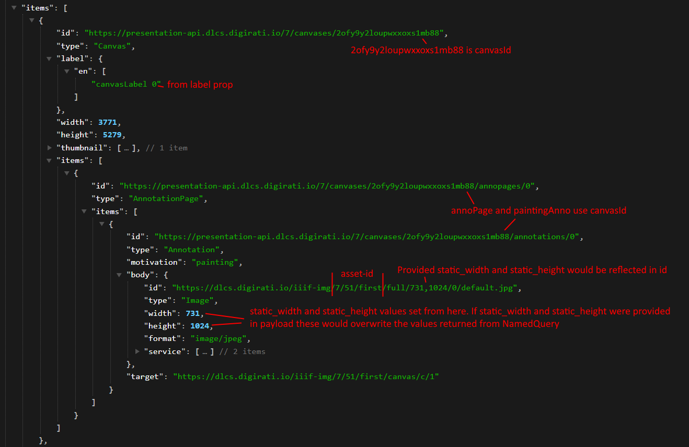
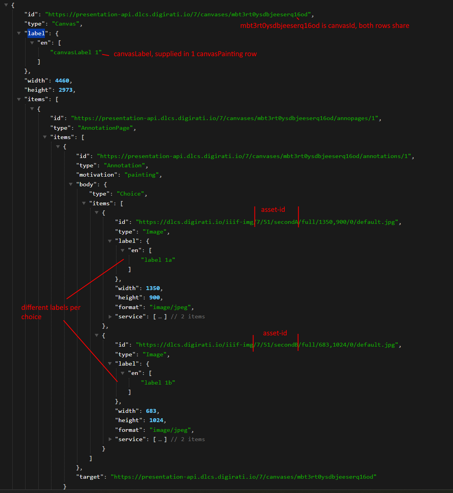

# "paintedResources" to Manifest

> [!TIP]
> All of this information is contained in [IIIF Netlify docs](https://deploy-preview-2--dlcs-docs.netlify.app/api-doc/iiif). 
> This is a further look at it with concrete examples.

This document outlines how properties of `"paintedResources"` are used to generate the final IIIF Manifest.

`"paintedResources"` contain 2 properties:
* `"asset"` - this is a valid IIIF Asset. This is mostly just passed through IIIF-P (some values are interrogated but for simplicity in this doc assume it's passed directly as-is).
* `"canvasPainting"` - an object that indicates how the `"asset"` should be associated with the canvas. This is optional - by default the association will be 1 item per canvas in the order that they are provided. However, `"canvasPainting"` allows the consumer a degree of control over how this works - the order of items, whether they form a choice, what the label should be etc. See [canvas paintings](canvas-paintings.md) notes on how incoming `canvasPainting` are stored in database.

## Why `"paintedResources"`?

There are 2 main reasons
* It simplifies the ingestion of assets. The complexity of managing *are these batch(es) ready yet?* is moved from the user and into the IIIF-P API. Without it, over time multiple consumers of the API would all have very similar approaches for craeting batches, waiting for completion and then generating manifests.
* It simplifies the generation of canvases. It removes the need to create `AnnotationPages` within `Annotations` withing `Canvases`, the IIIF-P API takes care of this.

## Manifest Construction

When a manifest is received with `"paintedResources"` the high level steps are:
* Construct `canvasPainting` DB rows. Using specified `"canvasPainting"` values OR default rules.
* Generate IIIF-CS batch(es) to ingestion assets.

Later, when IIIF-CS has ingested assets:
* Read `canvasPainting` records from database.
* Request NamedQuery to get IIIF Manifest containing content resources. The NamedQuery will always contain 1 asset per canvas, which we will transform into required shape.
* Disregard everything in NamedQuery, with the exception of Canvases.
* For each Canvas, workout which `AssetId` it is for. This is used to find the appropriate `CanvasPainting` record, from this we can determine how the final Canvas should look, what it's Id should be etc.
  * Implementation note - the NQ is reduced to a `Dictionary<AssetId, Canvas>` for ease of processing.

## Mapping Logic

Given the following data in the DB:

| canvas_id              | asset_id     | canvas_order | choice_order | thumbnail*                                 | label                    | canvas_label             | static_width* | static_height* |
| :--------------------- | :----------- | :----------- | :----------- | :----------------------------------------- | :----------------------- | :----------------------- | :------------ | :------------- |
| 2ofy9y2loupwxxoxs1mb88 | 7/51/first   | 0            | -1           | ../7/51/first/full/143,200/0/default.jpg   | {"en":["canvasLabel 0"]} | null                     | 731           | 1024           |
| mbt3rt0ysdbjeeserq16od | 7/51/secondA | 1            | 1            | ../7/51/secondA/full/200,133/0/default.jpg | {"en":["label 1a"]}      | {"en":["canvasLabel 1"]} | 1350          | 900            |
| mbt3rt0ysdbjeeserq16od | 7/51/secondB | 1            | 2            | ../7/51/secondB/full/133,200/0/default.jpg | {"en":["label 1b"]}      | null                     | 683           | 1024           |

> [!NOTE]
> Those columns marked with * are update from the incoming NQ canvas, unless they have been specified in the incoming `"canvasPainting"`. This gives the API consumer a degree of control over what is set but allows IIIF-P to store defaults if not provided.

The mapping would result in the following for canvas 0:

and for canvas 1, it's 1 canvas with multiple choices

