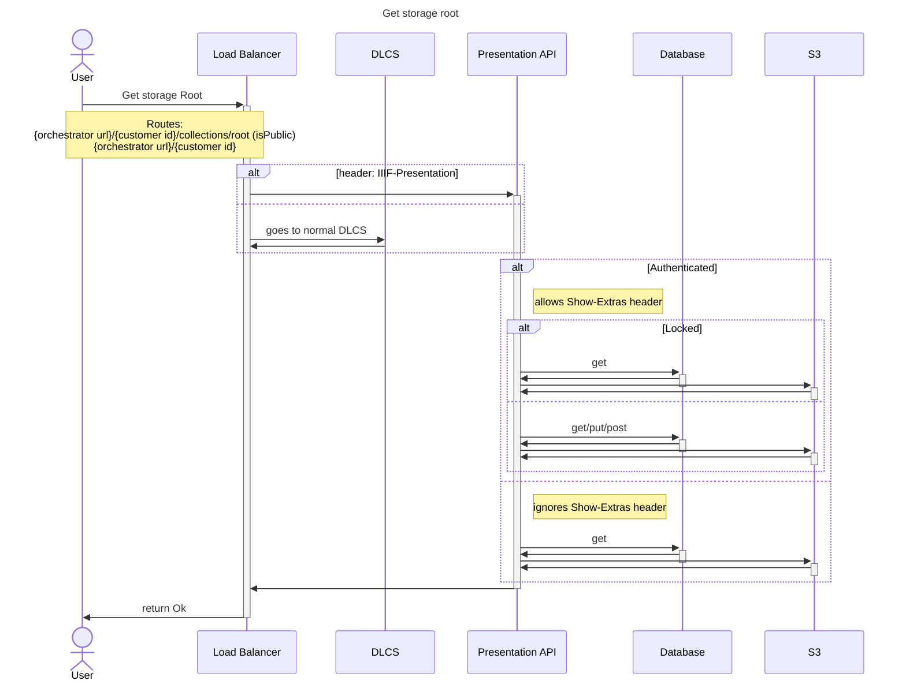
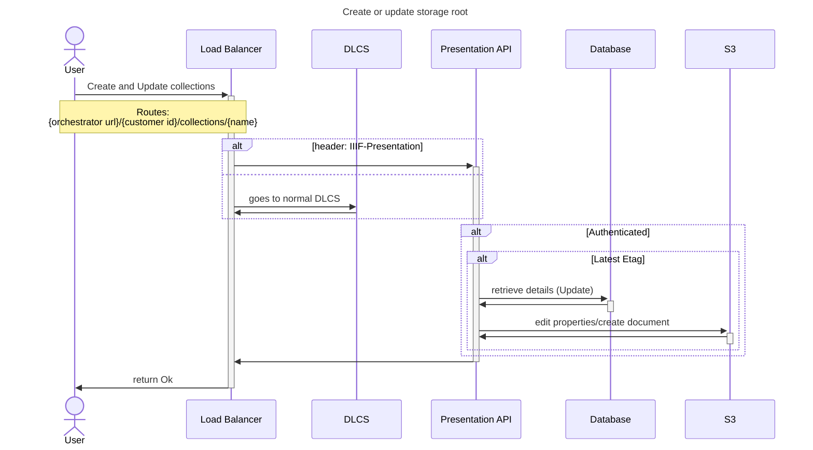
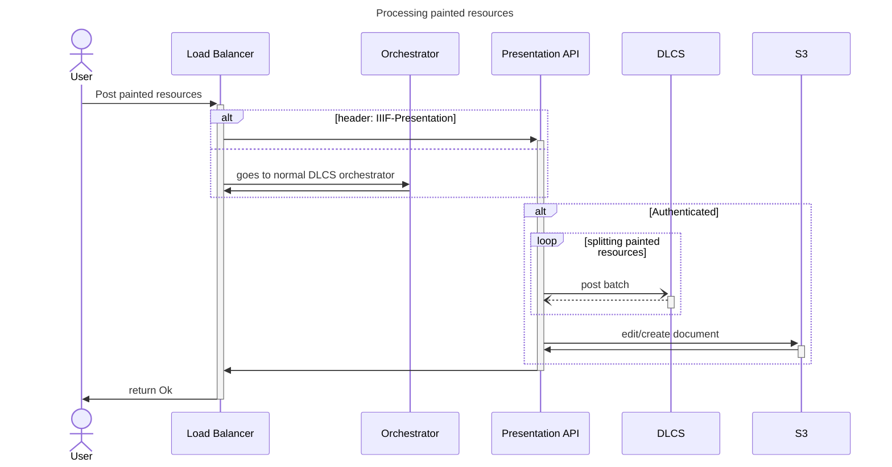
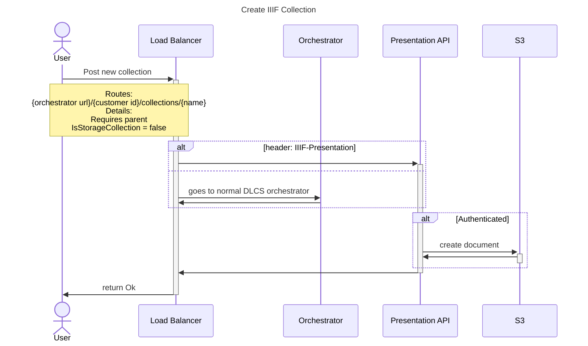

```mermaid
---
title: Get storage root
---
sequenceDiagram
    actor User
    participant LB as Load Balancer
    participant DLCS as DLCS
    participant P as Presentation API
    participant D as Database
    participant S3 as S3
    User->>+LB: Get storage Root
        Note over User, LB: Routes: <br> {orchestrator url}/{customer id}/collections/root (isPublic) <br>  {orchestrator url}/{customer id}
    alt header: IIIF-Presentation
        LB->>+P: 
    else
        LB->>DLCS: goes to normal DLCS
        DLCS->>LB: 
    end
    alt Authenticated
    Note right of P: allows Show-Extras header
    alt Locked
        P ->>+ D: get
        D ->>- P: 
        P ->>+ S3: 
        S3 ->>- P: 
    else
        P ->>+ D: get/put/post
        D ->>- P: 
        P ->>+ S3: 
        S3 ->>- P: 
    end
    else
    Note right of P: ignores Show-Extras header
        P ->>+ D: get
        D ->>- P: 
        P ->>+ S3: 
        S3 ->>- P: 
    end
    P->>-LB: 
    LB ->>- User: return Ok
```

```mermaid
---
title: Create or update storage root
---
sequenceDiagram
    actor User
    participant LB as Load Balancer
    participant DLCS as DLCS
    participant P as Presentation API
    participant D as Database
    participant S3 as S3
    User->>+LB: Create and Update collections
        Note over User, LB: Routes: <br> {orchestrator url}/{customer id}/collections/{name}
    alt header: IIIF-Presentation
        LB->>+P: 
    else
        LB->>DLCS: goes to normal DLCS
        DLCS->>LB: 
    end
    alt Authenticated
    alt Latest Etag
        P ->>+ D: retrieve details (Update)
        D ->>- P: 
        P ->>+ S3: edit properties/create document
        S3 ->>- P: 
    end
    end
    P->>-LB: 
    LB ->>- User: return Ok
```

```mermaid
---
title: Processing painted resources
---
sequenceDiagram
    actor User
    participant LB as Load Balancer
    participant O as Orchestrator
    participant P as Presentation API
    participant DLCS as DLCS
    participant S3 as S3
    User->>+LB: Post painted resources
    alt header: IIIF-Presentation
        LB->>+P: 
    else
        LB->>O: goes to normal DLCS orchestrator
        O->>LB: 
    end
    alt Authenticated
    loop splitting painted resources
        P -)+ DLCS: post batch
        DLCS --)- P: 
    end
            P ->>+ S3: edit/create document
        S3 ->>- P: 
    end
    P->>-LB: 
    LB ->>- User: return Ok
```

```mermaid
---
title: Create IIIF Collection
---
sequenceDiagram
    actor User
    participant LB as Load Balancer
    participant O as Orchestrator
    participant P as Presentation API
    participant S3 as S3
    User->>+LB: Post new collection
        Note over User, LB: Routes: <br> {orchestrator url}/{customer id}/collections/{name} <br> Details: <br> Requires parent <br> IsStorageCollection = false
    alt header: IIIF-Presentation
        LB->>+P: 
    else
        LB->>O: goes to normal DLCS orchestrator
        O->>LB: 
    end
    alt Authenticated
        P ->>+ S3: create document
        S3 ->>- P: 
    end
    P->>-LB: 
    LB ->>- User: return Ok
```