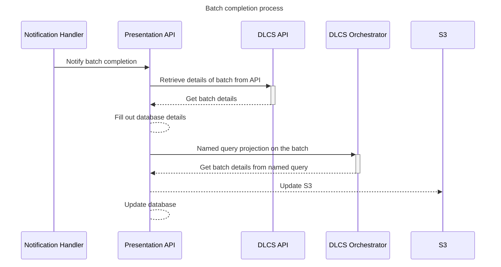

# Batch Completion Handling

see [Revisit Batches](https://github.com/dlcs/protagonist/pull/929/files#diff-0d380a6db64580407caa9f4adf06d996bda15e74e4781bc048b2ebf4da8e7b74) for the RFC on the Protagonist side of this work

Once a batch is completed by Protagonist, there are a series of steps that need to be completed that update the manifest with information from the completed images.  These include the `asset` section of the `CanvasPainting`, meaning updates to the database, and also updates to the `items` property, meaning changes to S3.  

This RFC outlines how the following will be accomplished:

- Authenticate with the DLCS
- Retrieve details from the DLCS API
- Retrieve details from the DLCS Orchestrator
- Update the manifest and database with details from the DLCS

## Proposal

Updating the details of a batch requires 2 separate calls to the DLCS to retrieve everything needed.  First a call to the API side to retrieve details from the API, such as width, height and errors.  After this a call is made to orchestrator to add the `Image-Service` and thumbnails.

This process can be demonstrated below:

The DLCS requires authentication on the API side, and the Presentation API method won't work for the background handler as it does not have access to a, authentication header to dforward.  As such, the backgeround handler will use JWT authentication to retrieve data

## Questions

There is future work around filling out details of an asset directly from the DLCS (to fill out hings like errors), if this is the case, do we need to call the API first as all these details can be filled out from the Orchestrator, such as the width/height

