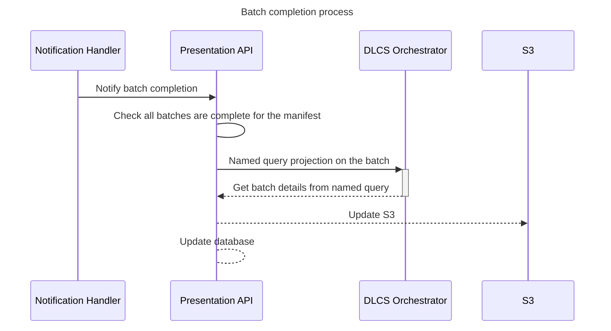

# Batch Completion Handling

see [Revisit Batches](https://github.com/dlcs/protagonist/pull/929/files#diff-0d380a6db64580407caa9f4adf06d996bda15e74e4781bc048b2ebf4da8e7b74) for the RFC on the Protagonist side of this work

Once a batch is completed by Protagonist, there are a series of steps that need to be completed that update the manifest with information from the completed images.

This RFC outlines how the following will be accomplished:

- Authenticate with the DLCS
- Retrieve details from the DLCS Orchestrator
- Update the manifest and database with details from the DLCS

## Proposal

Updating the details of a batch requires a call to orchestrator to add the `Image-Service` and thumbnails.

This process can be demonstrated below:

