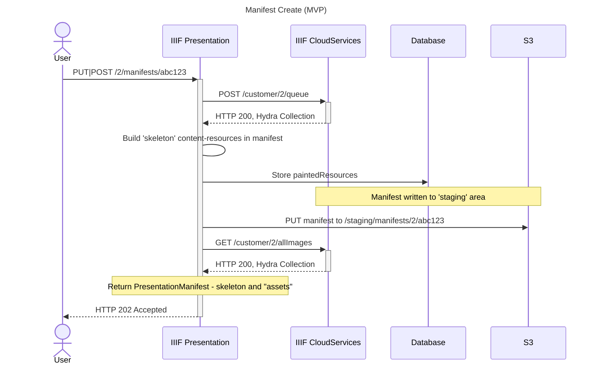
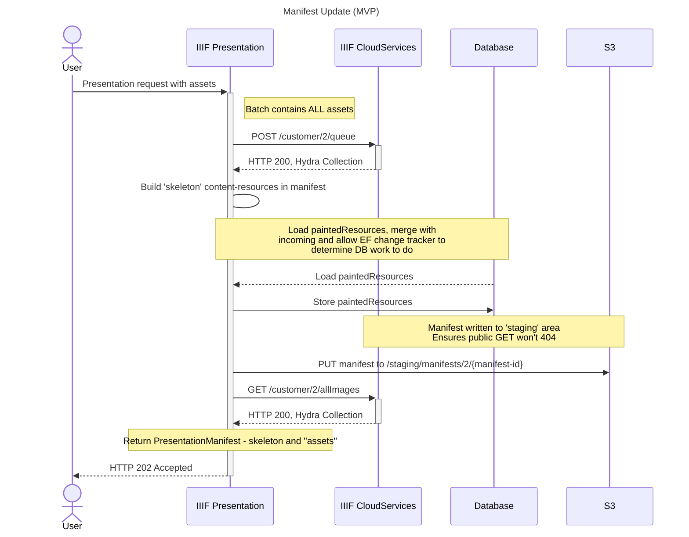
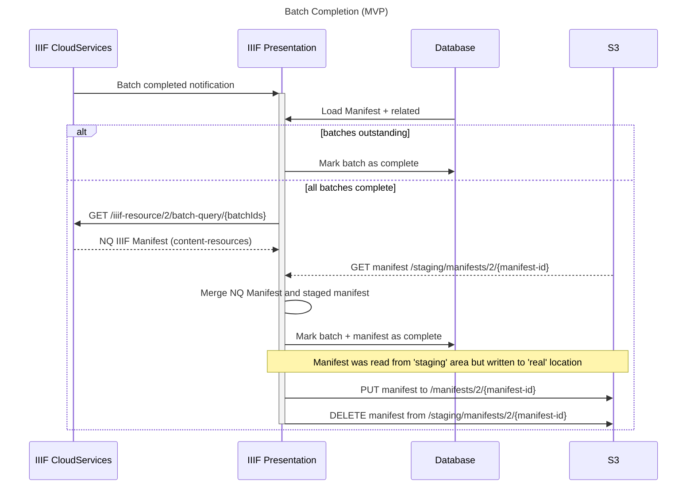
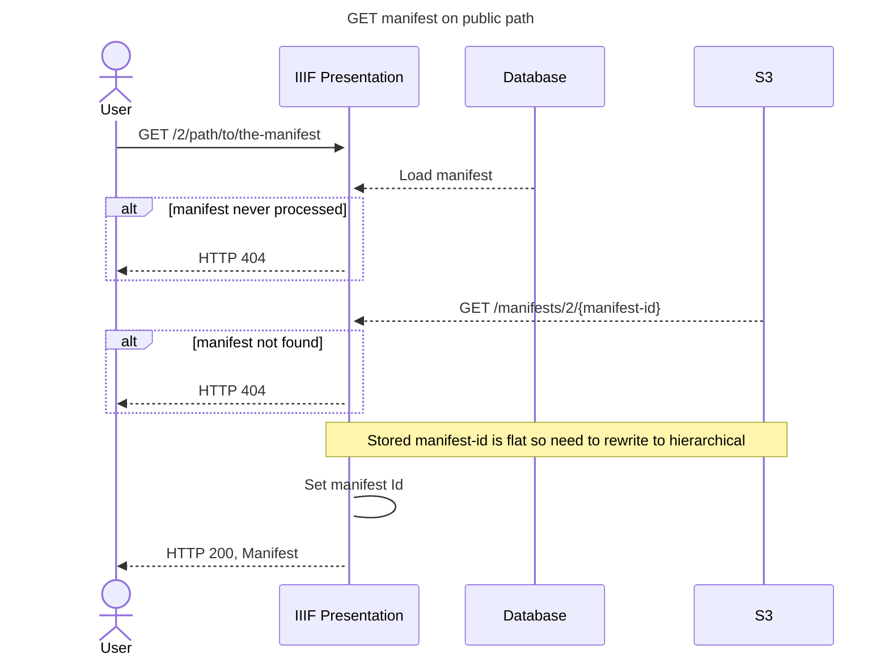
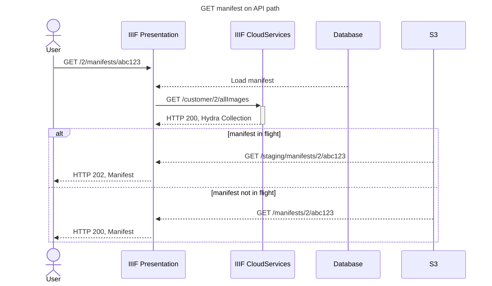

# Manifest Create and Update (MVP)

This document outlines Manifest create and update steps for manifests that contain `paintedResources`.

> [!Important]
> This outlines the **MVP** version only, this will be iterated on and updated in future RFC

Differences between MVP and full implementation:
* MVP will _always_ ingest assets to IIIF-CS. This means update for MVP is essentially a recreate operation, there won't be any logic to check whether the provided `paintedResources` have contain reordered canvases, new assets, deleted assets etc
  * This means we can use the `batch` named query parameter as every image in a manifest will be part of a batch that IIIF-P knows about.
* Full implementation will detect changes and only ingest what's required.
  * This means we _can't_ use `batch` and need to use `manifest` named query parameter instead, see [Protagonist RFC 019](https://github.com/dlcs/protagonist/blob/main/docs/rfcs/019-presentation-dlcs.md)
* MVP doesn't support mixing `"paintedResources"` and `"items"` properties 

The below sequence diagrams outline the flow for various stages of processing:

## Manifest Create (MVP)

Basic creation, PUT or POST for a manifest that doesn't exist.

Check for existence omitted for brevity.

## Manifest Update (MVP)

Update operation. As detailed above this is essentially a 'recreate' operation. 

The key difference is that some `paintedResources` may be deleted from DB as part of update but essentially everything else is the same as update.

## Batch Completion

The below diagram is simplified as it shows IIIF-CS directly notifying IIIF-P of batch completion, whereas this is done via a queue.

A single Manifest can have 1:n batches associated with it, the final manifest generation only happens when _all_ batches are complete.

## GET Request Handling

Shows how GET requests are handled and where manifests are delivered from. 

Passing auth and `X-IIIF-CS-Show-Extras` omited but assumed for API requests.

For clarity:
* `public` == Hierarchical Path
* `API` == Flat Path

### Public Path

The Manifest served is _always_ from the 'real' S3 location. 

This may be the current version, or it may be stale as there's a write operation in flight (in which case the 'staging' manifest will exist).

### API Path

The Manifest served may be from the 'staged' area if it's in-flight, or from the 'real' S3 location if not.

## Questions

* Is "staged" appropriate name for prefix? Do we need more than a 'simple' prefix - could there be multiple in-flight? (I don't think so).
* Will this concept of "staged" and not help with eventual lock/unlock?