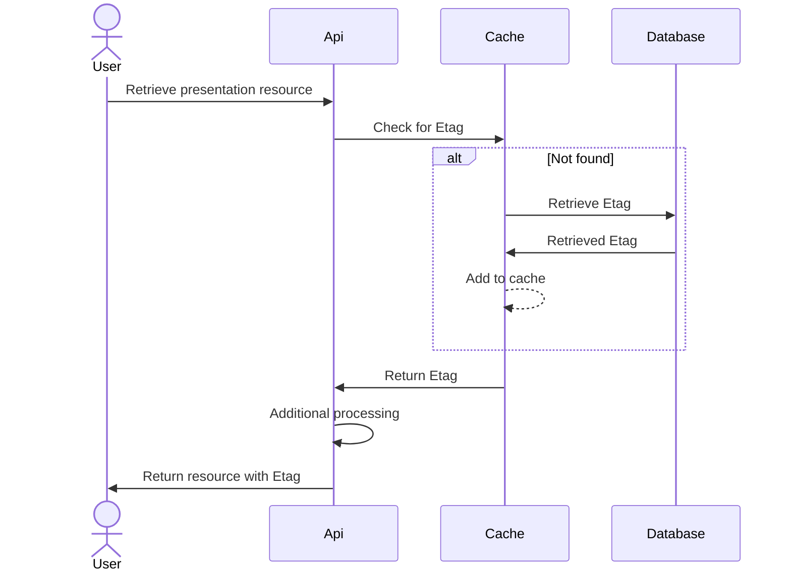
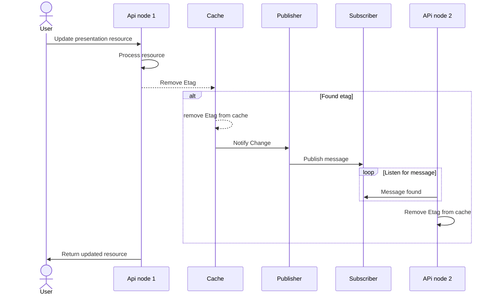
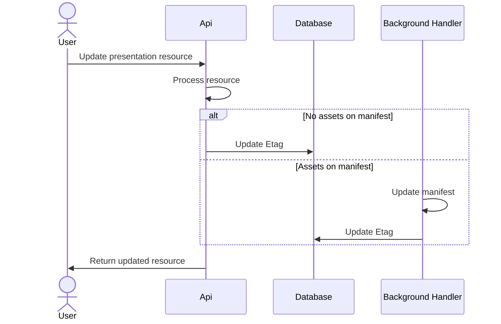

# Etag changes

This document contains details of how Etags can be mopdified to work better

For context, the current Etag implementation works as follows:

* Resources that return etags are marked with `[ETagCaching]` attribute.
  * This is a `ActionFilterAttribute` that generates the ETag by hashing the response body.
  * After generation the ETag is cached in-memory by request path.
* On subsequent requests the above cache is checked:
  * If not found, the request is rejected
  * If non-matching, request is rejected
  * If matching, request is processed

## Issues

While the current Etag implementation allows for easily adding and removing Etags from resources, there are several issues with the current approach:

- It doesn't scale
  - Resources being tracked in one instance will not be seen in the cache of another instance from scaling.  This would also be non-obvious to a user
- Updating older resources require that a GET be performed first
  - This adds the existing resource to the cache for usage
- Tracking doesn't survive restarts
- Etags change more often than needed
  - When PUTting the same resource, the Etag does change even if the underlying resource doesn't change

## Potential Fixes

This section is to discuss all options related to how the Etag changes could be made.

### Database storage

Solving this means that hashes should be generated up front and then shared between instances.  This likely means storing a value in the database that can be used to check the hash against.  This would aleviate issues with scaling, Etag values needing to be retrieved beforehand and Etag values not survivng restarts.

Doing this would mean an additional value being added to the database called `etag` that allows for the Etag to be stored.  Given that there are multiple resource types that require updating (manifests and collections) with their own table, while it would be possible to add a column onto the shared `hierarchy` table to reduce duplication, but due to the ability to create `canoncial` and `non-canonical` resources which would mean the Etag value is duplicated across the table.  Therefore, the preferered solution to this is to have another table containing the Etag, which would look like this:

| name | type | constraints |
|---|---|---|
| id | integer (autogenerated) | primary key |
| manifest_id | text | not null when `collection_id` is null |
| collection_id | text | not null when `manifest_id` is null |

### Caching

Currently, the Etag is saved into an in-memory cache that does not provide the ability to scale.

### No cache

Is the cache needed?  CVurrently most calls for retrieval directly hits the database, meaning that savings could be minimal.  However, this could be an issue if there are a lot calls being made, overwhelming the database.  This would be especially likely if the application has to start scaling due to multiple applications talking to the same database instance.

It should be fairly obvious when the database begins to become resource starved and in this case, any form of caching would improve the situation.

#### Distributed cache

This change would require that a call is made to the database to retrieve the Etag value, which would be slower than the current solution when checking the Etag.  A way to mitigate this would be to use an `IDistributedCache` that can be shared between instances, which would avoid the scaling issues as it shares the cache across all instances.

In order to use `IDistributedCache`, a backing cache needs to be selected, which could be Redis or a Postgres cache, though the specifc implementation of this is outside the scope of this RFC.

If the distributed cache wasn't hit, there would be fallback to the database.  The "happy path" for this process would look like this:

##### Issues

While using a distributed cache there are some problems that could make using one unviable:

- PUT/POST would benefit, but these operations are far less common and only completed by system administrators, and given the record needs to be retrieved from the database in the current implementation, the savings for this would only be on failed updates, rather than on all calls
- Increased complexity in management and infrastructure
- Distributed caches typically live in RAM and so can be expensive to run
- This is still a call to another external service
- Not required if the usage of the presentation API is not large

##### Benefits

- Implementation is shared between nodes, meaning it's easy to scale
- A failed match would not require calls to the database on items in the cache 
- Ultimately means less calls on the database, which could be a performance bottleneck

#### Publisher and subscriber with internal cache

This is a more complicated version odf using a distributed cache, where each instance has it's own internal cache, which is then notified by a queue to remove the Etag for a resource that is updated on another node.  This would have the same process as retrieval for the distributed cache, but has some additional complexity when updating a resource:

While this would work, there's a lot of additional complexity over the distributed cache, while providing the same benefits along with potential race conditions.  As such, while this has been mapped out for posterity, this option is being discarded.

### Generating the checksum

If the checksum is now being generated upfront instead of using the GET response to generate an Etag, there are some other ways of doing this:

#### Using the hash
This is the same way that it currently works, which is fine, but could mean there are differences between a checksum generated from a hierarchical PUT/POST and a flat PUT/POST

There's an issue with using the file to generate the hash in that PUT/POST can occur on the hierarchical path and the flat path which has different styles of request body.  This means that potentially updating a resource could have 2 different file hashes if using the request.  This can also happen with variations of `publicId`, `slug` and `parent`. Given these are ultimately the same request, it would be better for a single value to control the Etag on all of these requests and responses. This could be done using the response instead of the request, but there are issues with this around properties such as `ingesting` which will change based on assets. However, this would likely make for a better value when PATCH is integrated.

Additionally, the PUT/POST response is modified at a later date byt the background handler if there are assets attached to the manifest.  This would mean that Etags would not be available for manifests with assets until after processing was completed.  The full process would look like this:

 
#### Leveraging S3

S3 automatically generates a file hash we could take advantage of for using as an Etag value

  - This file hash is pre-generated and would be easy to retreive
- This has issues with storage collections, as these aren't stored in S3 - we could use a different system for generating this hash, but then that means there is a different code journey in this specific scenario, which has caused issues with other parts of the presentation API
- The S3 document updates at some point in the future when there are Assets attached to a manifest (i.e.: staging to live) - dealing with this would add complexity.  Though it would likely be easier to retrieve from the 
- There are some operations (like changing the hierarchy or slug) that won't result in changes to S3, meaning the hash won't be updated.  This is incorrect, so instead the hash would need to be updated 

#### Generated Etag

The final option is to not use the request/response to generate an Etag, but instead to use something like the id generator to generate a random identifier for an etag.  This could avoid issues with differences in request/response but create potential problems around collisions.  However, this might not be an issue as it's unlikely to occur and even if it did, there would be a very low chance of using these commmon identifiers to update different resources.

Geenrating the Etag could also be combined with data to indicate versioning (i.e. create has v1 encoded, first update v2 etc.) but care must be taken to make sure that these Etags look truly random as it's possible users begin ascribing meaning to the Etag values if they are too similar or seemingly follow a convention.

## Recomendations

Based on the information discussed above, these are what the new Etags process should do:

- The Etag should be stored in the database under a separate `etag` table
- While the distributed cache would be useful, as an initial implementation it would be ok to run using the direct database calls.  However, this should be monitored and if it seems that the database begins to become resource starved, then the distributed cache should be imlemented.  However, in the intervening time between deciding the cache is needed and deploying the implementation, additional resources can be dedicated to the [RDS instance](https://aws.amazon.com/rds/instance-types/) to mitigate issues with resource starvation.
- The hash of the response body should be used to generate the Etag as the S3 object has too many instances where it's not updated

## Other considerations

based on the [API scratchpad tests](https://github.com/dlcs/iiif-presentation-tests/blob/04213f185bf4fb370855e7e37be27ee4587234bf/tests/apiscratch/t0071-update-managed-asset-manifest.spec.ts#L60-L62) shows that editable resources (i.e.: PUT/POST) should not respond with Etags and instead would require a GET to retrieve the Etag.  This would have implications on the automated tests.

The presentation API [sends Cache-Control: no-cache headers](https://github.com/dlcs/iiif-presentation/issues/140) to stop clients from caching values and then serving old Etags.  As it stands, this shouldn't have an impact on how the Etags work

Storage collections would need to change the id whenever a child collection is added - a child collection would cause parent etag to update
massive amounts of collections would be slow to update a storage collection

There are multiple ways to call each individual resource (i.e.: POST hierarchical and POST flat).  There are so many small variations of the same resource that there could be 10 different Etags per presentation asset, which would quickly become difficult to maintain.  As such, there should be a single Etag per resource, which based on a reading of the Etag specification, would mean that the Etags need to be modified to use [weak validation](https://en.wikipedia.org/wiki/HTTP_ETag#Strong_and_weak_validation)