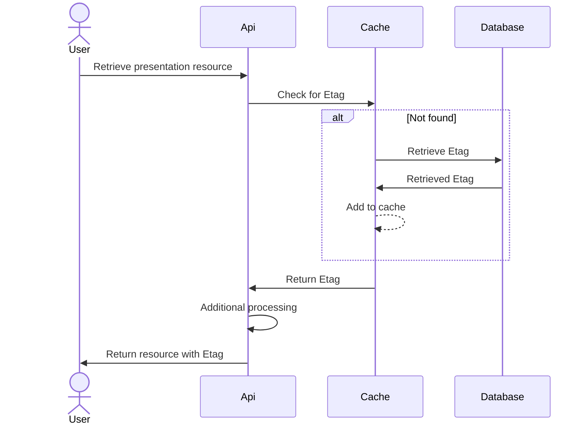
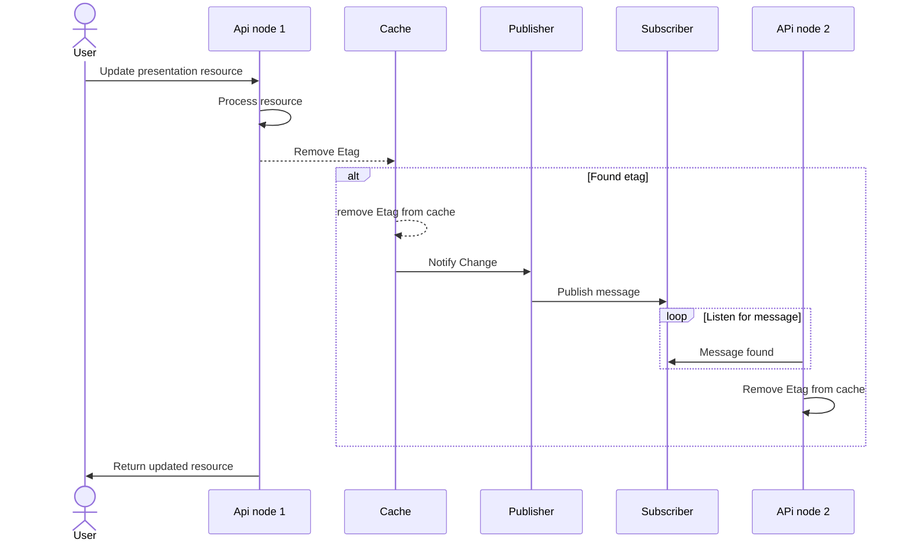
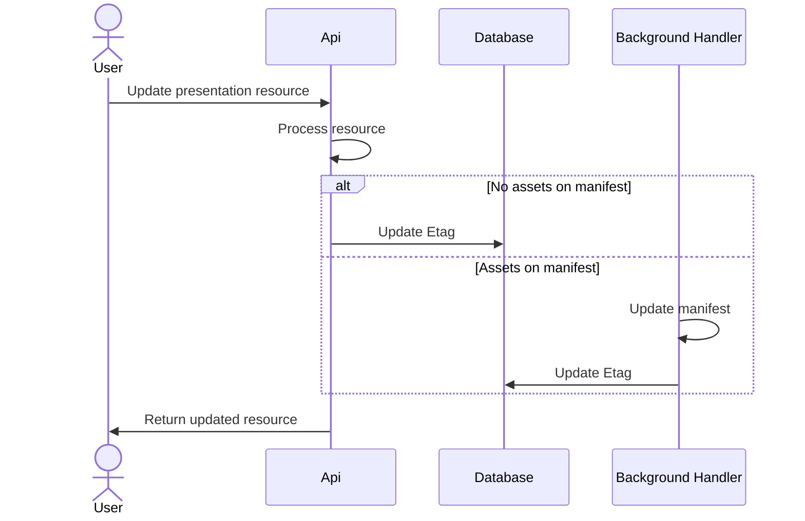

# Etag changes

This document contains details of how Etags can be modified to work better

For context, the current Etag implementation works as follows:

* Resources that return etags are marked with `[ETagCaching]` attribute.
  * This is a `ActionFilterAttribute` that generates the ETag by hashing the response body.
  * After generation the ETag is cached in-memory by request path.
* On subsequent requests the above cache is checked:
  * If not found, the request is rejected
  * If non-matching, request is rejected
  * If matching, request is processed

## Issues

While the current Etag implementation allows for easily adding and removing Etags from resources, there are several issues with the current approach:

- It doesn't scale
  - Resources being tracked in one instance will not be seen in the cache of another instance from scaling.  This would also be non-obvious to a user
- Updating older resources require that a GET be performed first
  - This adds the existing resource to the cache for usage
- Tracking doesn't survive restarts
- Etags change more often than needed
  - When PUTting the same resource, the Etag does change even if the underlying resource doesn't change

## Potential Fixes

This section is to discuss all options related to how the Etag changes could be made.

### Database storage

Solving this means that hashes should be generated up front and then shared between instances.  This means storing a value in the database that can be used to check the hash against.  This would alleviate issues with scaling, Etag values needing to be retrieved beforehand and Etag values not surviving restarts.

#### Additional table

Doing this would mean an additional value being added to the database called `etag` that allows for the Etag to be stored.  While it would be possible to add a column onto the shared `hierarchy` table, due to the ability to create `canonical` and `non-canonical` hierarchy records, it would mean the Etag value is duplicated within the table.  Therefore, a possible solution to reducing this is to have another table containing the Etag, which would look like this:

| name | type | constraints |
|---|---|---|
| id | integer (autogenerated) | primary key |
| manifest_id | text | not null when `collection_id` is null |
| collection_id | text | not null when `manifest_id` is null |
| etag | text|  |

#### Updating current database

Adding an additional table could be considered overkill given it's adding 4 columns for a single value that won't require duplication if added to existing tables.  This would mean adding an `etag` column to both the `collections` and `manifests` table.  However, the downside to this would be potentially differing implementations for adding etags to the database.  This can be mitigated by adding the `etag` column through `IHierarchyResource`.

### Caching

Currently, the Etag is saved into an in-memory cache that does not provide the ability to scale.

#### No cache

Is the cache needed?  Currently most calls for retrieval directly hits the database, meaning that savings could be minimal.  However, this could be an issue if there are a lot calls being made, overwhelming the database.  This would be especially likely if the application has to start scaling due to multiple applications talking to the same database instance.

Additionally, the need for scaling is still not certain, meaning that further thinking on this could just be adding unnecessary complication.  As such, just a simple in-memory cache with a short duration could be good enough.

It should be fairly obvious when the database begins to become resource starved and in this case, any form of caching would improve the situation. However, there are issues with this thinking, in that by the time it becomes obvious that resource starvation is an issue, it can often be too late to fix the problem as this is the point that requests start to fail. 

#### Distributed cache

This change would require that a call is made to the database to retrieve the Etag value, which would be slower than the current solution when checking the Etag.  A way to mitigate this would be to use an `IDistributedCache` that can be shared between instances, which would avoid the scaling issues as it shares the cache across all instances.

In order to use `IDistributedCache`, a backing cache needs to be selected, which could be Redis or a Postgres cache, though the specifc implementation of this is outside the scope of this RFC.

If the distributed cache wasn't hit, there would be fallback to the database.  The "happy path" for this process would look like this:

##### Issues

While using a distributed cache there are some problems that could make using one unviable:

- PUT/POST would benefit, but these operations are far less common and only completed by system administrators, and given the record needs to be retrieved from the database in the current implementation, the savings for this would only be on failed updates, rather than on all calls
- Increased complexity in management and infrastructure
- Distributed caches typically live in RAM and so can be expensive to run
- This is still a call to another external service
- Not required if the usage of the presentation API is not large

##### Benefits

- Implementation is shared between nodes, meaning it's easy to scale
- A failed match would not require calls to the database on items in the cache 
- Ultimately means less calls on the database, which could be a performance bottleneck
- Failed updates would fail faster due to knowing the Etag across the cache

#### Publisher and subscriber with internal cache

This is a more complicated version of using a distributed cache, where each instance has it's own internal cache, which is then notified by a queue to remove the Etag for a resource that is updated on another node.  This would have the same process as retrieval for the distributed cache, but has some additional complexity when updating a resource:

While this would work, there's a lot of additional complexity over the distributed cache, while providing the same benefits along with potential race conditions.  As such, while this has been mapped out for posterity, this option is being discarded.

#### Splitting read and write logic

If an option is chosen that does not take advantage of the distributed cache, there are potential issues with resource starvation.  A way to mitigate some of these issues, is to split the read and write logic so that it acts like the below:

Read requests:
- On receipt of GET w/ etag, get value from cache (read-through cache so may originate from DB)
- If we match, return 304 (memory-lookup only, inexpensive)
- Else, read content from DB + s3 and return with 200. On way out refresh cache with DB etag if it differs to ensure fresh.
  - If the given etag was for a later version than we had in-memory all we've done is fetch once from DB so minimal extra work.

Write requests:
- On receipt of PUT/POST with etag, get value from _db_ - ensures we're always look at the latest one.
- If eTag matches or not allow or not. Main thing is we got this fresh.

### Generating the checksum

If the checksum is now being generated upfront instead of using the GET response to generate an Etag, there are some other ways of doing this:

#### Using the hash of the request/response body

This is the same way that it currently works, which is fine, but could mean there are differences between a checksum generated from a hierarchical PUT/POST and a flat PUT/POST

There's an issue with using the file to generate the hash in that PUT/POST can occur on the hierarchical path and the flat path which has different styles of request body.  This means that potentially updating a resource could have 2 different file hashes if using the request.  This can also happen with variations of `publicId`, `slug` and `parent`. Given these are ultimately the same request, it would be better for a single value to control the Etag on all of these requests and responses. This could be done using the response instead of the request, but there are issues with this around properties such as `ingesting` which will change based on assets. However, this would likely make for a better value when PATCH is integrated.

Additionally, the PUT/POST response is modified at a later date by the background handler if there are assets attached to the manifest.  This would mean that Etags would not be available for manifests with assets until after processing was completed.  The full process would look like this:

 
#### Leveraging S3

S3 automatically generates a file hash we could take advantage of for using as an Etag value

  - This file hash is pre-generated and would be easy to retrieve
- This has issues with storage collections, as these aren't stored in S3
- The S3 document updates at some point in the future when there are Assets attached to a manifest (i.e.: staging to live) - dealing with this would add complexity.  Though it would likely be easier to retrieve from the 
- There are some operations (like changing the hierarchy or slug) that won't result in changes to S3, meaning the hash won't be updated.  This is incorrect, so instead the hash would need to be updated 
  - In order to get around issues with the item saved in S3 not being updated, the hash can be confirmed with the `slug`, `id` and `lastModified` time and then rehashed. The benefit of this is that the entire object does not need to be held in memory, and ECS is a memory constrained environment.

For storage collections, the `slug`, `id` and `lastModified` values can also be hashed with a randomized string (instead of the `items`), which will allow the Etag to change every time, but avoids having to retrieve `items` and from potentially having to hash something with hundreds of thousands of child `items`.

#### Generated Etag

The final option is to not use the request/response to generate an Etag, but instead to use something like the id generator to generate a random identifier for an etag.  This could avoid issues with differences in request/response but create potential problems around collisions.  However, this might not be an issue as it's unlikely to occur and even if it did, there would be a very low chance of using these common identifiers to update different resources.

Generating the Etag could also be combined with data to indicate versioning (i.e. create has v1 encoded, first update v2 etc.) but care must be taken to make sure that these Etags look truly random as it's possible users begin ascribing meaning to the Etag values if they are too similar or seemingly follow a convention.

### Cache key

If it's decided to use a cache, there are 2 potential paths that can be stored in the cache which would point at the same record, the hierarchical and flat path.  This means there are a couple of options for how to store the key in a cache.  This cache would contain the key (discussed here) and the value of the Etag.

#### Store by path

This is where the path to the resource would be used as the key for the cache, this would mean essentially the id on the flat path, and the public path for a hierarchical call.

As the path differs by hierarchical and flat paths, this would mean essentially storing the path twice and is how the current system works.  This is simpler, but does mean that the cache key could not be in the cache for one path, when the work has been done for another path. 

While there may be 2 keys added to the cache, at the point the record is retrieved, the path would be known from the `publicId` in the flat path, and the `id` from the database record when retrieving via a hierarchical path.  As such, both keys could be added to the cache at the same time meaning that the cache could be hit

#### Store by id

This is where the id is used regardless of if the request comes in on a hierarchical or flat path.  While this means there's more chance of hitting the cache, for a hierarchical path, the id is only known after the record has been retrieved from the database, which would break the point of caching this value.

## Recommendations

Based on the information discussed above, these are what the new Etags process should do:

- The Etag should be stored in the database under a column on the `manifests` and `collections` table
- While the distributed cache would be useful, as an initial implementation it would be ok to run using the direct database calls.  However, this should be monitored and if it seems that the database begins to become resource starved, then the distributed cache should be implemented.  Although, in the intervening time between deciding the cache is needed and deploying the implementation, additional resources can be dedicated to the [RDS instance](https://aws.amazon.com/rds/instance-types/) to mitigate issues with resource starvation. However, in preparation for this, an in-memory cache should be implemented using `IDistributedCache` with a short caching duration (~ 5 seconds)
- In order to help with potential resource starvation, the read and write logic should be split like mentioned above.
- S3 should be used to retrieve the hash as this avoids issues with keeping the response body in memory
- The cache key should be stored by path

## Other considerations

This section contains additional areas of concern where additional tickets should be generated to cover the below scenarios

based on the [API scratchpad tests](https://github.com/dlcs/iiif-presentation-tests/blob/04213f185bf4fb370855e7e37be27ee4587234bf/tests/apiscratch/t0071-update-managed-asset-manifest.spec.ts#L60-L62) shows that editable resources (i.e.: PUT/POST) should not respond with Etags and instead would require a GET to retrieve the Etag.  This would have implications on the automated tests.

The presentation API [sends Cache-Control: no-cache](https://github.com/dlcs/iiif-presentation/issues/140) headers to stop clients from caching values and then serving old Etags.  As it stands, this shouldn't have an impact on how the Etags work, due to how Cloudfront caches with the `no-cache` header.  Essentially, if the `Minimum TTL` is larger than 0, the `no-cache` header will not be respected, and instead cached for the `Minimum TTL` value. Details [here](https://docs.aws.amazon.com/AmazonCloudFront/latest/DeveloperGuide/Expiration.html).

**NOTE:** the dev environment currently has a `Minimum TTL` of 0, meaning nothing would be cached, it might be worth increasing this value.

Storage collections would need to change the id whenever a child collection is added - a child collection would cause parent etag to update
massive amounts of collections would be slow to update a storage collection

There are multiple ways to call each individual resource (i.e.: POST hierarchical and POST flat).  There are so many small variations of the same resource that there could be 10 different Etags per presentation asset, which would quickly become difficult to maintain.  As such, there should be a single Etag per resource, which based on a reading of the Etag specification, would mean that the Etags need to be modified to use [weak validation](https://en.wikipedia.org/wiki/HTTP_ETag#Strong_and_weak_validation)

When a child `collection` or a `manifest` is updated, this will also modify the `items` property of the parent storage collection.  This means that there needs to be an update to the Etag of the parent `collection`.