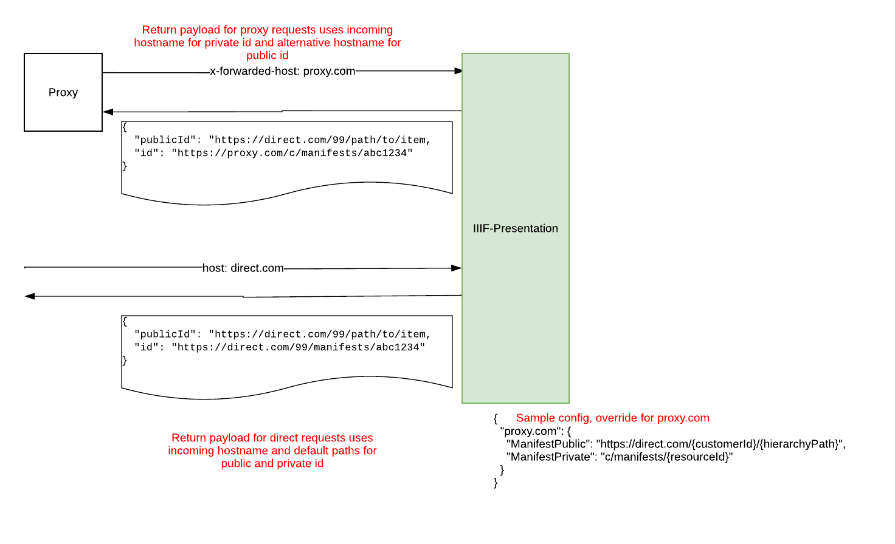

# Identity Rewrites

IIIF Presentation sets a number of identifiers on generated resources. Manifests and Collections can have different identifiers depending on whether they are accessed publicly, or via API paths.

By default all generated paths conform to a known, predictable format. However, there are instances where it's desirable to alter the paths when running IIIF Presentation behind a proxy (e.g. to omit customerId for dedicated instances).

This RFC outlines what identifiers are generated and suggests how we can have rules for both generating and accepting rewritten paths.

## Dereferenceable Identifiers

These are:

* Manifests: `id` property. Public and api variations.
  * Canonical public: `{customerId}/{hierarchyPath}` (e.g. `https://dlcs.example/123/path/to/item`)
  * Canonical private: `{customerId}/manifests/{resourceId}` (e.g. `https://dlcs.example/123/manifests/internal-id`)
* Collections: `id` property. Public and api variations
  * Canonical public: `{customerId}/{hierarchyPath}` (e.g. `https://dlcs.example/123/path/to/item`)
  * Canonical private: `{customerId}/collections/{resourceId}` (e.g. `https://dlcs.example/123/collections/internal-id`)
* Canvases: `id` property. Single variation only for both public and api requests.
  * Canonical `{customerId}/canvases/{canvasId}` (e.g. `https://dlcs.example/123/canvases/internal-id`)

## Non Dereferenceable Identifiers

> [!NOTE]
> Despite being mentioned above, canvas Id's are currently not dereferenceable but there are plans to do so.

AnnotationPages and PaintingAnnotations also have identities generated. These aren't expected to be dereferenceable in the near future but are included as we may want to rewrite for completeness.

Similar to Canvases, these only have 1 canonical path for both public and api requests:

* AnnotationPage canonical `{customerId}/canvases/{canvasId}/annopages/{canvas-order}` (e.g. `https://dlcs.example/123/canvases/internal-id/annopages/10`)
* PaintingAnnotation canonical `{customerId}/canvases/{canvasId}/annotations/{canvas-order}` (e.g. `https://dlcs.example/123/canvases/internal-id/annotations/10`)

## Path Templates

Protagonist [`Orchestrator`](https://github.com/dlcs/protagonist/blob/main/src/protagonist/Orchestrator/readme.md) and [`Thumbs`](https://github.com/dlcs/protagonist/blob/main/src/protagonist/Thumbs/Readme.md) support rewriting id values for some generated resources. The [path-templates](https://github.com/dlcs/protagonist/blob/main/docs/path-templates.md) document outlines how the configuration for this works. Note that Protagonist only writes `id` values on the way _out_ - it doesn't ever parse incoming paths. By the time Protagonist receives the request it is on a canonical path.

We should follow a similar approach for IIIF Presentation, where the path pattern used is dependant on the incoming host. 

The suggestion is to extend IIIF Presentation to have:
* Configuration keyed by hostname. Named configurations and a `"default"`. If there are no specific configuration, the canonical defaults apply. `"default"` can be used to set non-canonical paths as defaults if required.
* A number of named patterns (for Collections, Manifests etc). The number of variations are few enough that this should be fine.
* Each pattern has a list of known replacements (e.g. `{resourceId}` or `{customerId}`). When constructing paths these are used.

Example config appSetting:

```json
{
    "pathTemplate": {
        "foo.com": {
          "ManifestPublic": "{customerId}/{hierarchyPath}",
          "ManifestPrivate": "{customerId}/manifests/{resourceId}"
        },
        "bar.com": {
          "ManifestPublic": "https://foo.com/{customerId}/{hierarchyPath}"
        },
        "default": {
          "ManifestPublic": "foo/iiif/{hierarchyPath}",
          "ManifestPrivate": "just-manifest/{resourceId}"
        }
    }
}
```

where:
* `"foo.com"` defines the templates to use for `foo.com` hostname requests.
* `"bar.com"` defines the templates to use for `bar.com` hostname requests. Note that public manifest Ids will go to `foo.com` as it's a fully qualified URI and private will use the default template.
* `"default"` defines templates to use for all other hostnames. Note that this is optional and only required if the default templates differ from the above canonical paths (in the above `"foo.com"` uses the canonical path with the `"default"` values being non-canonical. This would allow, `presentation.com`, `dev.presentation.com`, `staging.presentation.com` etc to all use non-canonical paths with minimal config).

### Path Replacement values

The suggested replaceable values are:

* `{customerId}` - customer identifier
* `{hierarchyPath}` - only relevant for public paths. This is the generated hierarchical path. If supplied it _must_ be last element.
* `{resourceId}` - only relevant for private paths. The resource identifier (manifest, collection or canvas)

### Templates

The available templates are:

* `ManifestPublic` - paths for public/hierarchical manifest requests
* `ManifestPrivate` - paths for private/API manifest requests
* `CollectionPublic` - paths for public/hierarchical collection requests
* `CollectionPrivate` - paths for private/API collection requests
* `Canvas` - single canvas as it's same for public + private

### Asset Paths

IIIF-Presentation will never update the path for an asset, this logic belongs in Orchestrator and shouldn't be copied over. A Manifest will only ever have 1 set of ids for assets, they won't differ per incoming IIIF-Presentation hostname.

To allow some degree of control over the Asset paths used, each customer can have a specific `OrchestratorUrl` that is used to generate the base NamedQuery (with a default fallback for not specified). The generated NamedQuery will then use his hostname and any configured PathTemplates to output approproate Ids.

## Proxy Expectations

Proxies in front of IIIF Presentation must set the `x-forwarded-host` and `x-forwarded-proto` headers. 

These will then be used to automatically set `HttpContext.Request.Host` and `HttpContext.Request.Scheme` respectively.

> [!WARNING]
> Infra/deployment detail but we may need public paths proxied through CloudFront and API paths not. 
> 
> This would allow proxies such as Caspian to proxy API requests without `x-forwarded-host` being overwritten in CloudFront (unless we used something custom to detect and only set if not there).

As with Protagonist, the expectation is that there will be rewrite rules at the proxy level, this will ensure the appropriate dotnet routes are called.

### Dotnet Configuration

See [Configure ASP.NET Core to work with proxy servers and load balancers](https://learn.microsoft.com/en-us/aspnet/core/host-and-deploy/proxy-load-balancer?view=aspnetcore-8.0) on how `ForwardedHeadersMiddleware` are configured.

> [!TIP]
> This is already configured in IIIF Presentation

```cs
builder.Services.Configure<ForwardedHeadersOptions>(opts =>
{
    opts.ForwardedHeaders = ForwardedHeaders.XForwardedHost | ForwardedHeaders.XForwardedProto;
});

builder.Build().UseForwardedHeaders();
```

## Recognising Rewritten Paths

In addition to rewriting paths for output, the above configuration will need to be used to identify and parsing incoming paths. There are a number of fields, e.g. `parent_id` and `public_id`, that can be specified as full URIs.

IIIF Presentation will need to allow for specifying these in the canonical or rewritten representation. With the latter there may be some 'missing' values, customerId, that will need to be taken from the incoming route.

Regardless of the incoming format we only need to identify specific elements: `{resourceId}` and `{customerId}` for API requests and `{hierarchyPath}` and `{customerId}` for hierarchical requests.

See sample code in [appendix](#appendix) for sketch of how this might work.

> [!WARNING]  
> The URI parsing rules in IIIF Presentation are inconsistent.
> 
> Some validate the hostname and some don't. We should look at paths only, ignoring hostname as mentioned in [#273](https://github.com/dlcs/iiif-presentation/issues/273)

## Automatic Redirects

There are instances where IIIF Presentation will automatically redirect requests from public to private or vice-versa. 

These redirects would also take advantage of the rewrite rules and redirect to the appropriate `*Public` or `*Private` path as required, depending on the current hostname.

## Customer Specific

The above configuration needs to be able to be specified at a customer level to allow adequate control.

## Example

The below example shows sample configuration and ability to control public/private id depending on incoming host/`x-forwarded-host`. The configured config allows for the same public id to be used in both instances, while private id differs.



## Disregarded Options

The following options were disregarded

### Replacement values per type

Using a separate replacement value per type, e.g. `{manifestId}`, `{collectionId}` and `{canvasId}`. 

Having a single `{resourceId}` is simpler, considering there is only 1 per path.

### Single path per type

Related to above, rather than having different templates per resource type (`ManifestPublic`, `CollectionPrivate`) etc, have a single `ResourcePublic` and `ResourcePrivate` with a `{type}` replacement value.

While this would likely fit most use-cases it could be restrictive.

### `x-forwarded-prefix`

The `x-forwarded-prefix` header can be used to set `HttpContext.Request.PathBase`. This was disregarded as the replacement values allow the same behaviour.

`PathBase` is currently not configured in IIIF Presentation API but if it is we may need to consider pulling this in.

## Other Points

* For `AnnotationPages` and `PaintingAnnotations` we won't have custom rewrite paths. We'll always append `/annopages/{canvas-order}` or `/annotations/{canvas-order}` to canvasId (may revisit if required).
* Initially we can store these values in AppSettings, with scope to make controllable via API in future if required. We would need to consider that changes to hostnames generally involve proxy changes, or other infrastructure configuration so may always want to manage as an admin user.

## Appendix

### Sample Alt Template Parsing

```cs
void Main()
{
	/*
	* Sample script for parsing incoming paths, in canonical and rewritten formats. 
	* From these get CustomerId and manifestId.
	* PoC only, no error handling etc
	*/
	
	// Sample rewrite templates, not including canonical
	const string altTemplate1 = "/foo/just-manifest/{manifestId}";
	const string altTemplate2 = "{manifestId}/{customer}";
	const string altTemplate3 = "/foo/{customer}/diff/{manifestId}";
	var templates = new string[]{ altTemplate1, altTemplate2, altTemplate3 };
	
	// Sample incoming paths, 1 matching canonical and 1 per rewrite pattern
	var canonical = "/99/manifests/123abc";
	var alt1 = "/foo/just-manifest/123abc"; // no customerId
	var alt2 = "/123abc/99"; // manifest + customer reversed
	var alt3 = "/foo/99/diff/123abc"; // starts like alt1 but diff element and customerId
	
	// This would come from Route
	const int customerId = 99;

	// Validate we can parse each alternative rewrite
	foreach (var path in new string[]{ canonical, alt1, alt2, alt3 })
	{
		var parsed = ParseInput(templates, path, customerId);
		
		parsed.Customer.ShouldBe(99);
		parsed.ResourceId.ShouldBe("123abc");
		parsed.Canonical.ShouldBe(path == canonical);
	}
	
	Console.WriteLine("Done");
}

public static PathParts ParseInput(string[] templates, string path, int customer)
{
	var replacementRegex = new Regex("^{(.+)}$");
	
	// Always try and parse canonical first
	var canonical = ParseCanonical(path);
	if (canonical != null) return canonical;

	// Not canonical - try and match to a path...
	// First split the path into it's individual segments
	var pathSplit = path.Split("/", StringSplitOptions.RemoveEmptyEntries | StringSplitOptions.TrimEntries);
		
	foreach (var t in templates)
	{
		int? customerId = null;
		string manifestId = null;
		bool customerIdInPath = false;
		
		// Split template into chunks
		var templateSplit = t.Split("/", StringSplitOptions.RemoveEmptyEntries | StringSplitOptions.TrimEntries);
		
		// Check lengths are same, if not don't compare
		if (pathSplit.Length != templateSplit.Length) continue;

		for (int x = 0; x < pathSplit.Length; x++)
		{
			var templatePart = templateSplit[x];
			var valuePart = pathSplit[x];
			
			// Check if this is a replacement value - if so get value from provided path 
			if (replacementRegex.IsMatch(templatePart))
			{
				// This is a template - get the value of it from the path value
				var capturedValue = replacementRegex.Match(templatePart).Groups[1].Value.ToString();
				if (capturedValue == "customer")
				{
					customerIdInPath = true;
					customerId = int.Parse(valuePart);
				};
				if (capturedValue == "manifestId") manifestId = valuePart;
			}
			else if (templatePart != valuePart)
			{
				// if this isn't a path replacement and the values don't match, abort
				break;
			}
		}
		
		// If the customerId wasn't in the path, set to the passed in val
		if (!customerIdInPath) customerId = customer;
		
		if (customerId != null && manifestId != null) return new PathParts(customerId, manifestId, false);
	}
	
	return new PathParts(null, null, false);
	
}

public static PathParts ParseCanonical(string path)
{
	var canonicalRegex = new Regex("^\\/(\\d+)\\/(manifests|collections)\\/([\\w\\d]+)$");

	if (!canonicalRegex.IsMatch(path)) return null;
	
	var matches = canonicalRegex.Match(path);
	return new PathParts(int.Parse(matches.Groups[1].Value), matches.Groups[3].Value.ToString(), true);
}

public record PathParts(int? Customer, string ResourceId, bool Canonical);
```