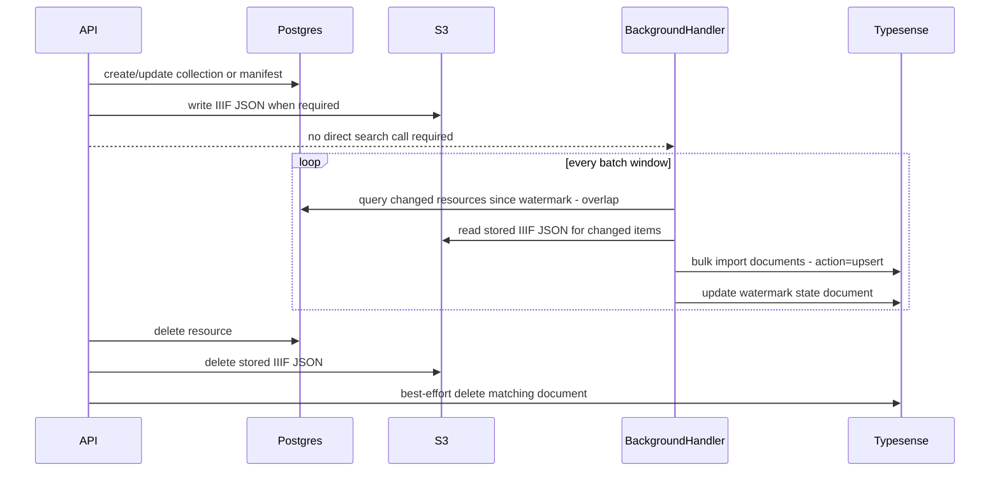

# Typesense Search Index

This document describes how IIIF-Presentation can maintain a shared search index in Typesense without adding new
Postgres tables or columns.

The goal is to support search across folders, IIIF collections and manifests from a single index that can serve both
public-facing query flows and internal UI flows. The feature must remain optional, must not break write requests when
Typesense is unavailable, and must fit the existing split between the API and the `BackgroundHandler`.

## Context And Constraints

There are a few constraints in the current codebase that shape the design:

* IIIF Collections and Manifests are not fully represented in the database. The database stores core identity,
  hierarchy and a few summary fields, while the complete IIIF JSON lives in S3.
* Manifests can exist in a staging state while assets are ingesting and then later move to the final S3 location.
* `collections.modified`, `manifests.modified` and `manifests.last_processed` already act as the best available
  timestamps for deciding what needs to be reprocessed.
* `BackgroundHandler` already exists for asynchronous work, but there is no generic scheduler or job framework.
* Schema changes are undesirable for this feature, particularly where the same information can be derived from the
  current hierarchy and S3 content.

Because of the above, the design needs to:

* read descriptive IIIF properties from stored JSON instead of trying to denormalize everything into Postgres
* react to manifest ingest completion via existing timestamps
* handle hierarchy changes that affect descendant URLs without relying on new database triggers or columns
* degrade safely when Typesense is misconfigured or temporarily unavailable

## Options Considered

### Direct write-through from the API only

The most obvious approach is to update Typesense directly from the API write paths for create, update and delete
operations.

This is attractive because it is straightforward and gives fast propagation for writes. However, it does not fit well
with the current architecture:

* manifest completion can happen later in the background when DLCS ingestion finishes
* the full IIIF JSON often needs to be read from S3 to build the search document
* hierarchy changes on parent collections require descendant reindexing
* a failing Typesense write would end up coupled to the request path unless a separate retry mechanism was introduced

This option was rejected as the primary mechanism.

### Queue or event driven sync

Another option is to emit explicit events for every hierarchy, collection and manifest mutation and then process those
events into Typesense.

This would provide a strong audit trail and precise change handling, but it is significantly more infrastructure than is
needed for the current requirement. The repository does not currently emit internal domain events for storage changes,
and adding a new event channel would introduce more moving parts than the rest of the application uses today.

This option remains viable in the future but is not the best fit for an initial implementation.

### Database polling only

Polling based on existing timestamps is simple and fits the current stack. A periodic background task can look for
changes in `collections.modified`, `manifests.modified` and `manifests.last_processed`, build documents, and bulk
upsert them.

The weakness of pure polling is deletion. Once a resource is gone from Postgres there is no timestamp to poll for, so a
polling-only design needs some form of orphan detection or tombstone storage.

Polling alone is also slightly awkward when a collection move changes descendant public URLs, since descendants may not
get their own timestamps updated.

### Recommended: background batched upserts, API delete, periodic orphan repair

The recommended approach is a hybrid:

* `BackgroundHandler` owns schema bootstrap, full backfill, incremental polling and repair sweeps
* the API performs a best-effort Typesense document delete after a successful resource deletion
* a periodic orphan sweep remains in place as safety net rather than the primary delete mechanism

This keeps request paths resilient while still reacting quickly enough for search indexing.

## Recommended Schema

The index contains one document per resource using:

`id = "{customerId}:{resourceType}:{flatId}"`

Resource types are:

* `storage_collection`
* `iiif_collection`
* `manifest`

The main index stores:

* identity and routing fields: `customer_id`, `resource_type`, `flat_id`, `public_id`, `api_id`, `slug`,
  `full_path`, `parent_flat_id`
* descriptive search text: `label`, `summary_text`, `metadata_text`, `required_statement_text`, `provider_text`,
  `homepage_text`, `see_also_text`, `rendering_text`, `rights`, `nav_date_ts`
* display helpers: `thumbnail`, `tags`
* visibility and state: `is_public`, `is_processed`, `is_in_progress`
* recency fields: `modified_ts`, `last_processed_ts`
* an unindexed `iiif_descriptive` object containing the top-level IIIF descriptive properties as originally stored

The descriptive content is built from the stored IIIF JSON for IIIF collections and manifests. Storage collections do
not have stored IIIF JSON, so only the DB-backed descriptive fields are indexed there.

For manifests, thumbnail selection prefers the first ordered `CanvasPainting.Thumbnail`. If that is not available, the
top-level IIIF thumbnail is used.

## Bootstrap And Alias Strategy

The search index uses a stable alias, `iiif_presentation`, that points to a versioned physical collection. A companion
Typesense collection stores the active physical collection name and the sync watermark.

On startup, the background sync process:

1. ensures the state collection exists
2. reads the current alias and state document
3. if the alias is missing, the state is missing, or the schema version differs, creates a fresh physical collection
4. backfills all collections and manifests into that new physical collection
5. repoints the alias to the new collection
6. stores the new state and deletes the previous collection

This allows schema evolution without any Postgres migration or in-place Typesense mutation.

## Incremental Sync

Incremental sync reads from existing timestamps only:

* `collections.modified`
* `manifests.modified`
* `manifests.last_processed`

The sync task intentionally overlaps the last processed window by one batch interval. If an import partially fails, the
watermark is not advanced. The next run simply re-reads the overlapping range and retries the affected upserts.

Hierarchy changes need additional handling. If a changed collection now resolves to a different `public_id` or
`full_path` than the currently indexed document, the implementation recursively enumerates descendants from `hierarchy`
and reindexes the entire subtree. This handles parent slug moves without new hierarchy columns or triggers.

## Failure Handling

Typesense is configured through an optional `Typesense` settings section. If `BaseUrl` or `ApiKey` is missing, the
integration becomes a no-op.

If Typesense is configured but unavailable:

* API create and update requests still succeed because they do not synchronously depend on Typesense
* API delete requests still succeed; the search delete is best-effort and logged on failure
* background sync logs the error and retries on the next cycle
* the watermark only advances after a clean import

This makes the integration fail-safe and operationally separate from the primary data path.

## Test And Rollout Considerations

The implementation should be covered at three levels:

* unit tests for document building, descriptive-field extraction, Typesense import parsing and alias/state handling
* service-level tests for bootstrap, watermark overlap, descendant reindex and orphan removal
* API integration tests proving delete remains successful even if the search delete path fails

Rollout should start with Typesense disabled by default. Enabling it in an environment should only require:

* Typesense connection settings
* running the existing `BackgroundHandler`
* observing the initial bootstrap and subsequent incremental cycles in logs

Because the feature is additive and optional, it can be rolled out gradually without changing the storage API surface.
