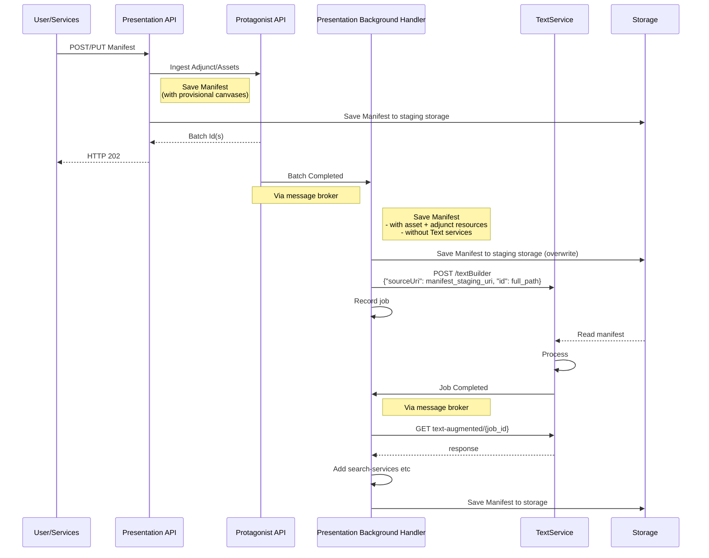
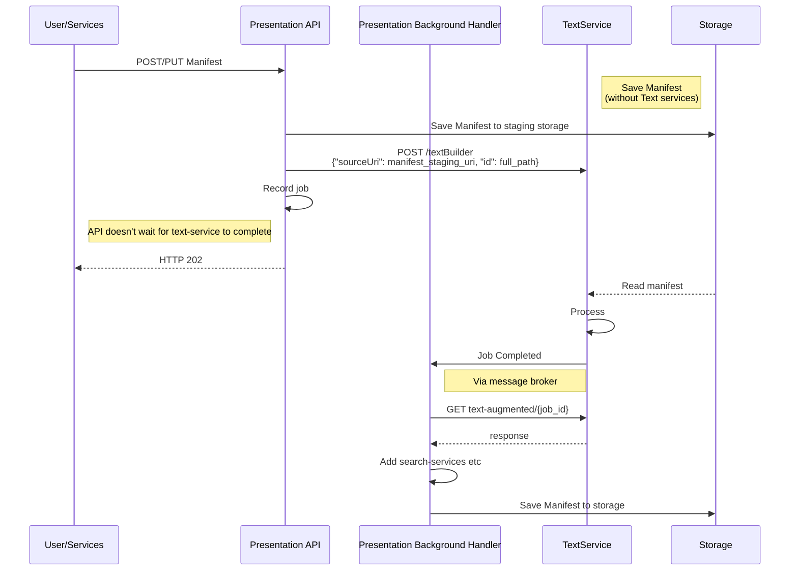
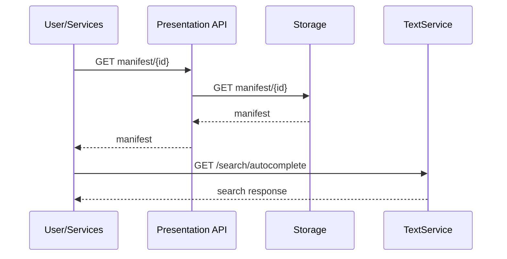

# Text Services

This RFC explores how we can extend the processing of IIIF Manifests to support adding various text-services, such as:

* [IIIF Content Search V2](https://iiif.io/api/search/2.0/) and [V1](https://iiif.io/api/search/1.0/)
* PDF w/ text layer
* Line/word annotation pages and manifest-level
* Plain text endpoint

## Overview

At a high level, the process will be to extend the accepted manifest payload, to include an additional property that instructs IIIF-Presentation to include text-services, extracted from any relevant Manifest properties.

This will be done by leveraging the [text-services](https://github.com/dlcs/text-services) builder API.

The overall process is
* Manifest payload instructs IIIF-Presentation to index text.
* Manifest is processed as normal (ie Assets and Adjuncts ingested if required). What currently would be the "final" Manifest is saved but _not made publicly available_.
  * The consumer will not have an eTag at this point, the consumer will be unable to update the Manifest until text-services extraction is complete.
* Text-services job is created, the processed Manifest is used as the source for job.
  * This can be done by API or BackgroundHandler depending on whether IIIF-CS is ingesting resources.
* Upon job completion, the Manifest is updated to include content-search services etc.
  * Initially this will be a subset of the resources exposed by text-services but will be extended later.

## Text Sources

Text-services can use a variety of sources containing text; including hOCR, webVTT and METS-ALTO.

In order for text to be extracted, the Manifest must have some associated text-bearing content. This can have been supplied to IIIF-Presentation via standard IIIF, or added as an IIIF-CS adjunct. As long as it's exposed on the Manifest via a property that [text-services supports](https://github.com/dlcs/text-services#supported-text-formats), the text will be indexed.

IIIF-Presentation won't do any scanning of Manifests to validate whether it has supported properties; if text indexing is requested then it will always send the Manifest to text-services. This might result in slightly more churn in text-services but avoids any need to alter IIIF-Presentation if text-services adds support for new formats. This may result in no text content being added.

## "pipeline" property

> Manifest payload instructs IIIF-Presentation to index text.

When sending a Manifest to IIIF-Presentation we will support a new `"pipeline"` property, e.g.

```json
{
    "pipeline": {
        "text": {
            "index": true
        }
    }
}
```

Where:
* `"pipeline"` is the top level containing property for indicating that there is some further processing to be done to the Manifest as a whole.
* `"text"` indicates the type of pipeline. At this time this is the only accepted value.
* `"index": true` signifies that we want to index any text associated with this Manifest.

Other properties will be added to the `"text"` property in the future, to give greater control of what is processed (e.g. "content-search only" or "content-search and a PDF, using X as a cover-page").

The `"pipeline"` behaviour specified in the payload will be recorded against the current processing of the Manifest, for picking up later. Any Manifests that have a `"pipeline"` specified will require further processing (ie will return a 202|Accepted).

> [!CAUTION]
> For initial implementation we won't support running any OCR/HTR etc pipelines to extract text, the sources must already be associated with the Manifest.
>
> Collections won't support `"text"` pipeline.

### Pipeline Enhancements

The `"pipeline"` property is so named to allow us to extend and offer additional pipelines in the future, e.g. OCR/HTR.

Exactly how these will be used will need to be explored, having a single property to extend should allow us a flexible starting point.

## Manifest as Input

> Text-services job is created, the processed Manifest is used as the source for job.

The IIIF Manifest will serve as the input to text-services. This will be a full, valid IIIF Manifest without any custom properties included.

We need to have the processed Manifest available as the source for text indexing but it won't have been made public yet, therefore IIIF-Presentation will need to store a version of the Manifest that can be used as input. We already have the concept of a "staged" Manifest. Currently, this is interim storage between API receipt and background-handler completion. If text indexing is required, the "staged" Manifest will either be the payload as received, or the Manifest generated from IIIF-CS NamedQuery.

We will need some way to share the non-public resource with text-services. As we are using S3 for storage this can be done via IAM/bucket permissions or a presigned URL. There is nothing private in the Manifest, it's non-public because it hasn't been fully processed yet, not because the content is sensitive. If no `"pipeline"` property is provided then this is where processing would stop.

### Alternative

The alternative would be for IIIF-Presentation to construct a [`sourceData`](https://github.com/dlcs/text-services/blob/main/docs/builder-api.md#post-textbuilder--create-a-job) payload.

This was dismissed as it would involve IIIF-Presentation having knowledge of how best to identify text-bearing resources; this is best left to text-services as it can expand that logic without IIIF-Presentation needing to change.

## Text-Services Completion

> Upon job completion, the Manifest is updated to include content-search services etc

When the text-services job is completed the BackgroundHandler will fetch the payload outlining what resources were generated. If no resources were generated then there is nothing more to be done to the Manifest, it can be moved from staging location and made public without any changes.

If there are resources to add, these will be placed in the relevant locations on the Manifest. For example, IIIF Content-Search resources will be added to the relevant `"services"` property, PDFs will be added to `"rendering"` etc.

> [!IMPORTANT]
> All resources will be added as long as the `"id"` value does not already exist. This will allow safe round-tripping of Manifests without adding duplicate resources.
>
> This follows the same logic of adding adjuncts to a Manifest.

If text-services fails due to an error we should make the Manifest public but record the error somewhere that will be visible to private authenticated requests with `X-IIIF-CS-Show-Extras`.

## TextService Interaction

### Job Identity

All text-services jobs will have format as `{customer}/{manifest-id}`, where:
* `{customer}` is the customers numeric identifier to scope any further identifiers to this customer.
* `{manifest-id}` is the Manifest's _internal_ identifier. This ensures the any generated sources relate to the specified Manifest, regardless of it's location in the hierarchy.

Using `{customer}/{hierarchy-slug}` (e.g. `99/19th-century/fiction/1984`) would read nicer than `{customer}/{manifest-id}` (e.g. `99/asfdh09234532`) but would mean that any 
hierarcy moves would break existing text-service links or require a lot of additional work to drop/create jobs.

#### Paths

Text-Services support [alternative paths](https://github.com/dlcs/text-services/blob/main/instructions/alternative-paths.md) via `X-Forwarded-Host` and `X-Forwarded-Path` headers.

When the background-handler is constructing final payloads it should always call the canonical `/text-augmented/v3` URL and provide these headers manually, rather than going via any proxy rewrites.

* `X-Forwarded-Host` will be `CustomerOrchestratorUri` if configured, falling back to default.
* `X-Forwarded-Path` will be require an additional `PathRules` setting.

### Ingest Pipeline

#### Manifest requires IIIF-CS work

The below diagram outlines how text services will be added to a Manifest, full process for Manifests containing assets and/or adjuncts that require ingest.



> [!NOTE]
> The above is a change to processing as the staged Manifest is overwritten.
> 
> This ensures any GETs with `X-IIIF-CS-Show-Extras` would see that the Manifest has been updated but not yet finished.

#### Without IIIF-CS work

The below diagram outlines how text services will be added to a Manifest, full process for Manifests that do not require any IIIF-CS interactions.



> [!TIP]
> This means that 202|Accepted can be returned for Manifests that don't have assets or adjuncts.

Some points to note related to the above 2 diagrams
* The `full_path` posted to the `/textBuilder` will be either the canonical or rewritten Manifest public path, depending on configuration. This will form the route for all text resources.
* The job creation follows the same semantics as current resources that require additional work. IIIF-Presentation will return a 202 without an eTag to prevent any changes until the current operation is finished.

### Request Manifest

The below diagram shows the broad flow of serving a request, highlighting that the Manifest is still served by IIIF-Presentation but search requests are fulfilled by text-services.



## Updates

If a Manifest that contains search-services is re-submitted without `pipeline.text.index: true` then the updated Manifest won't contain any generated services. They will persist in text-services and won't be deleted but they will no longer be advertised on the Manifest.

This follows current practice of treating every Manifest payload as a full update; we don't diff against the previous Manifest. Each payload is taken in isolation.

## Enhancements

Below are future enhancements.

### Coverpages

A future use-case is to allow a consumer to generate a PDF containing a custom coverpage.

A possible way to do this would be to accept a "coverpage" property as part of the pipeline, e.g.

```jsonc
{
    "pipeline": {
        "text": {
            "index": true,
            // a single URL
            "coverpageUrl": "https://cov.er/abc123.pdf",
            // text or HTML
            "coverpageText": "This is a coverpage. There are many like it but this one is mine"
        }
    }
}
```

Exactly how this property would look will depend upon the support within text-services. The above shows `coverpageUrl` and `coverpageText` - we may support either, or both of these.

In order to support inclusion of coverpage we would need to create text-services jobs with more than just the Manifest sourceUri. We would ideally need some hybrid of sourceUri and sourceData, allowing us to state _"Use this Manifest but add this cover page"_.

### Text Operations

Text-services allow consumer to specify which services/derivatives should be generated. A future implementation could be allow the consumer to control what is produced and exposed.

This is currently modeled as a flags enum in text-services which may not be the best option to expose for consumers. We can assess the best approach when implementing.

## Open Questions

* If text indexing is requested but no text-bearing sources were found, should we record this anywhere? Something on the Manifest that can be surfaced in `X-IIIF-CS-Show-Extras` view? This is not necessarily an "error" but could be useful to record.
* Is the behaviour described in [Updates](#updates) correct when a Manifest with text-services is updated without a `"pipeline"` property? 
* All text-services jobs will have format as `{customer}/{manifest-id}` - do we need another level of 'scope' to this to avoid accidentally overwriting job from elsewhere? e.g. `/iiif-presentation/{customer}/{manifest-id}` or `/{customer}/manifest/{manifest-id}`